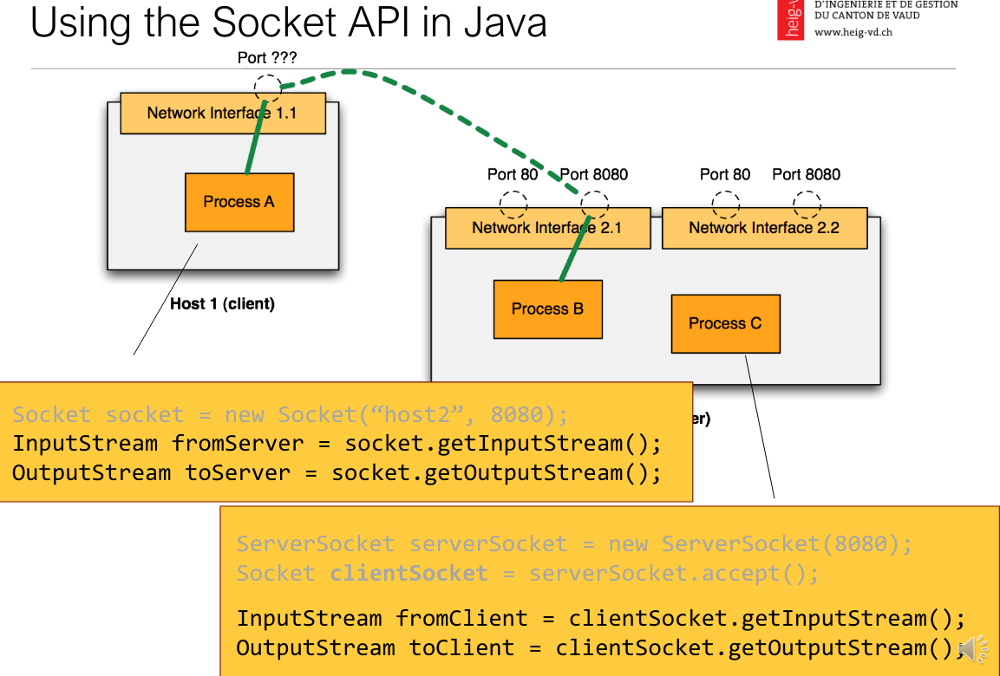

# API Test 1

## Table of contents
* [JavaIO](#JavaIO)
	* [Classes available](#Classes-available)
	* [Reading / Writing Byte one at the time](#reading--writing-byte-one-at-the-time)
	* [Encoding](#encoding)
	* [Reading / Writing Characters one at a time](#reading--writing-characters-one-at-a-time)
	* [Buffered IOs](#buffered-ios)
	* [Universal API example](#universal-api-example)
* [TCP Programming](#tcp-programming)
	* [Pseudo-code Server & client](#pseudo-code-server--client)
	* [Version single thread](#version-single-thread)
	* [Version multi thread](#version-multi-thread)
* Questions
	* [Questions Java](#questions-java-)
	* [Questions TCP](#questions-tcp-)

## JavaIO

### Classes available

```java
// Import
import java.io.*;
import java.nio.charset.StandardCharsets;
```

Reading / Writing **Byte** one at the time

- FileInputStream (values: -1→255 (byte)) -1 = end of stream
- FileOutputStream

Reading / Writing **Byte** one at the time

- FileReader (values: -1→65535 (char))
- FileWriter

Buffered IOs : FAST

- BufferedInputStream
- BufferedOutputStream
- BufferedReader
- BufferedWriter

### Reading / Writing **Byte** one at the time

```java
FileInputStream fis = null;
FileOutputStream fos = null;

// Read
try {
    fis = new FileInputStream("myfile.bin");
    int b = fis.read(); // blocking call
    while (b != -1) // -1 indicates that we are at the end of the stream
        b = fis.read(); // blocking call
} catch (IOException e) {
    System.err.println(e.getMessage());
} finally {
    try {
        if (fis != null)
            fis.close();
    } catch (IOException e) {
        System.err.println(e.getMessage());
    }
}

// Read & Write
try {
    fis = new FileInputStream("myfile.png");
    fos = new FileOutputStream("copy.png");
    int b = fis.read();
    while (b != -1) {
        fos.write(b); // This is a blocking call
        b = fis.read();
    }
    fos.flush(); // Write data to the OS. Always use flush before closing the stream.
} catch (IOException e) {
    System.err.println(e.getMessage());
} finally {
    try {
        if (fos != null)
            fos.close();
    } catch (IOException e) {
        System.err.println(e.getMessage());
    }
    try {
        if (fis != null)
            fis.close();
    } catch (IOException e) {
        System.err.println(e.getMessage());
    }
}
```

### Encoding

Can't specify encoding with `FileReader`, need to use `InputStreamReader`

```java
InputStreamReader reader = new **InputStreamReader**(new FileInputStream(file), "UTF-8");
// is safer than
Reader reader = new FileReader(file); // what is the “default” encoding???
```

### Reading / Writing **Characters** one at a time

```java
// Read + Write
InputStreamReader isr = null;
OutputStreamWriter osw = null;

try {
    isr = new InputStreamReader(new FileInputStream("input.txt"), StandardCharsets.UTF_8);
    osw = new OutputStreamWriter(new FileOutputStream("copy.txt"), StandardCharsets.UTF_8);

    int c = isr.read();
    while (c != -1) {
        osw.write(c);
        c = isr.read();
    }
    osw.flush();
} catch (IOException e) {
    System.err.println(e.getMessage());
} finally {
    try {
        if (osw != null)
            osw.close();
    } catch (IOException e) {
        System.err.println(e.getMessage());
    }

    try {
        if (isr != null)
            isr.close();
    } catch (IOException e) {
        System.err.println(e.getMessage());
    }
}

// other example of read + write
FileReader fr = FileReader(“input.txt”);
FileWriter fw = FileWriter(“copy.txt”);
int c = fr.read();
while ( c != -1 ) {
	fw.write(c);
	c = fr.read();
}
fw.flush(); 
fw.close();
fr.close();
```

### **Buffered IOs**

```java
// Binary data -----------------------------------------------
BufferedInputStream bis = null;
BufferedOutputStream bos = null;

try {
    bis = new BufferedInputStream(new FileInputStream("myfile.png"));
    bos = new BufferedOutputStream(new FileOutputStream("copy.png"));

    int c = bis.read();
    while (c != -1) {
        bos.write(c);
        c = bis.read();
    }
    bos.flush();
} catch (IOException e) {
    System.err.println(e.getMessage());
} finally {
    try {
        if (bos != null)
            bos.close();
    } catch (IOException e) {
        System.err.println(e.getMessage());
    }
    try {
        if (bis != null)
            bis.close();
    } catch (IOException e) {
        System.err.println(e.getMessage());
    }
}

// Textual data -----------------------------------------------
BufferedReader in = null;
BufferedWriter out = null;

try {
    in = new BufferedReader(
            new InputStreamReader(
                    new FileInputStream("input.txt"), StandardCharsets.UTF_8));
    out = new BufferedWriter(
            new OutputStreamWriter(
                    new FileOutputStream("copy.txt"), StandardCharsets.UTF_8));

    int c = in.read();
    while (c != -1) {
        out.write(c);
        c = in.read();
    }
    out.flush();
} catch (IOException e) {
    System.err.println(e.getMessage());
} finally {
    try {
        if (out != null)
            out.close();
    } catch (IOException e) {
        System.err.println(e.getMessage());
    }

    try {
        if (in != null)
            in.close();
    } catch (IOException e) {
        System.err.println(e.getMessage());
    }
}
```

**Print & Read line by line**

```java

// Read ----------------------------------------------------------------
BufferedReader r = new BufferedReader(
               new InputStreamReader(
                       new FileInputStream("myfile.txt"), StandardCharsets.UTF_8));
        
while (r.ready()) {
    String line = r.readLine();
}
// Write ---------------------------------------------------------------
PrintWriter pw = new PrintWriter(
			        new BufferedWriter(new OutputStreamWriter(
		                new FileOutputStream("myfile.txt"), StandardCharsets.UTF_8)));
pw.println("Text in myfile.txt");
pw.flush();

// More complete example -----------------------------------------------
BufferedReader in = null;
BufferedWriter out = null;

try {
    in = new BufferedReader(
            new InputStreamReader(
                    new FileInputStream("input.txt"), StandardCharsets.UTF_8));
    out = new BufferedWriter(
            new OutputStreamWriter(
                    new FileOutputStream("copy.txt"), StandardCharsets.UTF_8));

    String line;
    while ((line = in.readLine()) != null) {
        out.write(line + "\n");
	out.flush();
    }
} catch (IOException e) {
    System.err.println(e.getMessage());
} finally {
    try {
        if (out != null)
            out.close();
    } catch (IOException e) {
        System.err.println(e.getMessage());
    }

    try {
        if (in != null)
            in.close();
    } catch (IOException e) {
        System.err.println(e.getMessage());
    }
}
```

### Universal API example

```java
/**
* This interface will work only for data sources on the file system. In the
* method implementation, I would need to create a FileInputStream from f and
* read bytes from it.
*/
public interface IPoorlyDesignedService {
	public void readAndProcessBinaryDataFromFile(File f);
}

/**
* This interface is much better. The client using the service has a bit more
* responsibility (and work). It is up to the client to select a data source
* (which can still be a file, but can be something else). The method implementation
* will ignore where it is reading bytes from. Nice for reuse, nice for testing.
*/
public interface INicelyDesignedService {
	public void readAndProcessBinaryData(InputStream is);
}
```

## TCP Programming

### Pseudo-code Server & client

```java
// Server
1. Create a "receptionist" socket
2. Bind the socket to an IP address / port
3. Loop
3.1. Accept an incoming connection (block until a client arrives)
3.2. Receive a new client socket when a client has arrived
3.3. Read and write bytes through this socket, communicating with the client
3.4. Close the client socket (and go back to listening)
4. Close the "receptionist" socket

// Client
1. Create a socket
2. Make a connection request on an IP address / port
3. Read and write bytes through this socket, communicating with the client
4. Close the client socket
```



### Version single thread

Server

```java
package com.heigvd;

import java.io.*;
import java.net.ServerSocket;
import java.net.Socket;
import java.nio.charset.StandardCharsets;
import java.util.logging.Level;
import java.util.logging.Logger;

public class SingleThreadServer {
    private final static Logger LOG = Logger.getLogger(SingleThreadServer.class.getName());
    private final int PORT = 8000;

    /**
     * Main function to start the server
     */
    public static void main(String[] args) {
        System.setProperty("java.util.logging.SimpleFormatter.format", "%4$s: %5$s%6$s%n");
        (new SingleThreadServer()).start();
    }

    void start() {
        LOG.log(Level.INFO, "Server is starting ...");
        ServerSocket serverSocket;
        Socket clientSocket = null;

        /* Create a socket */
        try {
            serverSocket = new ServerSocket(PORT);
            LOG.log(Level.INFO, "Socket created : " + serverSocket.toString());
        } catch (IOException e) {
            LOG.log(Level.SEVERE, e.toString(), e);
            return;
        }

        /* Socket is created, now wait for incoming connections */
        while (true) {
            try {
                LOG.log(Level.INFO, "Waiting for client ...");
                clientSocket = serverSocket.accept(); // This is a blocking call
                LOG.log(Level.INFO, "Client socket created : " + clientSocket.toString());
                handleClient(clientSocket);

            } catch (IOException e) {
                LOG.log(Level.SEVERE, e.toString(), e);
                return;
            } finally {
                try {
                    if (clientSocket != null && !clientSocket.isClosed())
                        clientSocket.close();
                } catch (IOException e) {
                    LOG.log(Level.SEVERE, e.toString(), e);
                }
            }
        }
    }

    private void handleClient(Socket clientSocket) {
        BufferedReader in = null;
        BufferedWriter out = null;

        try {
            in = new BufferedReader(new InputStreamReader(clientSocket.getInputStream(), StandardCharsets.UTF_8));
            out = new BufferedWriter(new OutputStreamWriter(clientSocket.getOutputStream(), StandardCharsets.UTF_8));

            out.write("Hello from SingleThread server\n");
            out.flush();

            String line;
            while ((line = in.readLine()) != null) {
                LOG.info("Client : " + line);

                String answer = line.toUpperCase() + '\n';
                out.write(answer);
                out.flush();
            }

            LOG.info("Cleaning up resources...");
        } catch (IOException e) {
            LOG.log(Level.SEVERE, e.toString(), e);
        } finally {
            try {
                if (in != null)
                    in.close();
            } catch (IOException e) {
                LOG.log(Level.SEVERE, e.toString(), e);
            }
            try {
                if (out != null)
                    out.close();
            } catch (IOException e) {
                LOG.log(Level.SEVERE, e.toString(), e);
            }
            try {
                if (clientSocket != null && !clientSocket.isClosed())
                    clientSocket.close();
            } catch (IOException e) {
                LOG.log(Level.SEVERE, e.toString(), e);
            }
        }
    }
}
```

### Version multi thread

Server Tenant

```java
package com.heigvd;

import java.io.IOException;
import java.net.ServerSocket;
import java.net.Socket;
import java.util.logging.Level;
import java.util.logging.Logger;

public class MultiThreadServer {
    private final static Logger LOG = Logger.getLogger(MultiThreadServer.class.getName());
    private final int PORT = 8000;

    /**
     * Main function to start the server
     */
    public static void main(String[] args) {
        // Log output on a single line
        System.setProperty("java.util.logging.SimpleFormatter.format", "%4$s: %5$s%6$s%n");
        (new MultiThreadServer()).start();
    }

    /**
     * Start the server on a listening socket.
     */
    private void start() {
        ServerSocket serverSocket = null;
        try {
            // Create the server socket
            serverSocket = new ServerSocket(PORT);
            // Waiting for new clients to connect
            while (true) {
                LOG.log(Level.INFO, "Waiting for client ...");
                Socket clientSocket = serverSocket.accept(); // This is a blocking call
                System.out.println("New connection accepted");
                // Create new thread to handle this client
                ServerWorker worker = new ServerWorker(clientSocket);
                Thread thread = new Thread(worker);
                thread.start();
            }
        } catch (IOException e) {
            LOG.log(Level.SEVERE, e.toString(), e);
        } finally {
            try {
                if (serverSocket != null && !serverSocket.isClosed())
                serverSocket.close();
            } catch (IOException e) {
                LOG.log(Level.SEVERE, e.toString(), e);
            }
        }
    }
}
```

Server Worker 

```java
package com.heigvd;

import java.io.*;
import java.net.Socket;
import java.nio.charset.StandardCharsets;
import java.util.logging.Level;
import java.util.logging.Logger;

public class ServerWorker implements Runnable {
    private final static Logger LOG = Logger.getLogger(ServerWorker.class.getName());
    private Socket clientSocket;
    private BufferedReader in = null;
    private BufferedWriter out = null;

    public ServerWorker(Socket clientSocket) {
        try {
            this.clientSocket = clientSocket;
            in = new BufferedReader(new InputStreamReader(clientSocket.getInputStream(), StandardCharsets.UTF_8));
            out = new BufferedWriter(new OutputStreamWriter(clientSocket.getOutputStream(), StandardCharsets.UTF_8));
        } catch (IOException e) {
            System.err.println(e.getMessage());
        }
    }

    @Override
    public void run() {
        try {

            out.write("Hello from Server worker\n");
            out.flush();

            while (!clientSocket.isClosed()) {
                String line;
                while ((line = in.readLine()) != null) { // Read and handle message
                    LOG.info("Client : " + line);
                    String answer = line.toUpperCase() + '\n';
                    out.write(answer);
                    out.flush();
                }
            }
        } catch (IOException e) {
            LOG.log(Level.SEVERE, e.toString(), e);
        } finally {
            try {
                if (in != null)
                    in.close();
            } catch (IOException e) {
                LOG.log(Level.SEVERE, e.toString(), e);
            }
            try {
                if (out != null)
                    out.close();
            } catch (IOException e) {
                LOG.log(Level.SEVERE, e.toString(), e);
            }
            try {
                if (clientSocket != null && !clientSocket.isClosed())
                    clientSocket.close();
            } catch (IOException e) {
                LOG.log(Level.SEVERE, e.toString(), e);
            }
        }
    }
}
```

Client

```java
package com.heigvd;

import java.io.*;
import java.net.Socket;
import java.nio.charset.StandardCharsets;
import java.util.logging.Level;
import java.util.logging.Logger;

public class Client {
    private final static Logger LOG = Logger.getLogger(Client.class.getName());
    private static final int PORT = 8000;
    private static final String HOST = "localhost";

    public static void main(String[] args) {
        System.setProperty("java.util.logging.SimpleFormatter.format", "%4$s: %5$s%6$s%n");

        Socket clientSocket = null;
        BufferedReader in = null;
        BufferedWriter out = null;
        BufferedReader usrin = null;

        try {
            clientSocket = new Socket(HOST, PORT);

            in = new BufferedReader(new InputStreamReader(clientSocket.getInputStream(), StandardCharsets.UTF_8));
            out = new BufferedWriter(new OutputStreamWriter(clientSocket.getOutputStream(), StandardCharsets.UTF_8));
            usrin = new BufferedReader(new InputStreamReader(System.in, StandardCharsets.UTF_8));

            LOG.log(Level.INFO, "Connected to" + clientSocket);

            String line = "ThIS is a TeSt", response;

            while ((response = in.readLine()) != null) {
                System.out.println("Server : " + response);

                if (response.equals(line.toUpperCase())) {
                    LOG.log(Level.INFO, "Answer from server is correct");
                    break;
                }

                out.write(line + '\n');
                out.flush();
            }
        } catch (IOException e) {
            LOG.log(Level.SEVERE, e.toString(), e);
        } finally {
            try {
                if (usrin != null)
                    usrin.close();
            } catch (IOException e) {
                LOG.log(Level.SEVERE, e.toString(), e);
            }
            try {
                if (in != null)
                    in.close();
            } catch (IOException e) {
                LOG.log(Level.SEVERE, e.toString(), e);
            }
            try {
                if (out != null)
                    out.close();
            } catch (IOException e) {
                LOG.log(Level.SEVERE, e.toString(), e);
            }
            try {
                if (clientSocket != null && !clientSocket.isClosed())
                    clientSocket.close();
            } catch (IOException e) {
                LOG.log(Level.SEVERE, e.toString(), e);
            }
        }
    }
}
```
### QUESTIONS JAVA :
**Why can we say that the Java IO API is a universal API?**

L'API Java IO est universelle, car elle peut être utilisée dès qu'il y a un transfert de données, que ce soit des bytes ou des caractères.

**Explain the notions of source, sink and stream in context of IO processing.**

Une source génère une séquence de bytes ou de caractères.  
Un évier consomme une séquence de bytes ou de caractères.  
Un stream est un tube qui permet le transfert de données entre une source et un évier. Un InpuStream si on lit, un OutputStream si on écrit.

**What is the difference between an  InputStream  and a  Reader ?**

On utilise un Reader quand on manipule des caractères, elle fait une conversion entre les données brutes binaires et les caractères avec un encodage spécifique. C'est une classe abstraite. L'InputStream quant à lui est utilisé quand on utilise des bytes, des données RAW.


**Write a program that reads the content of a file A, converts all characters to uppercase and writes the result into a file B.**

NIK

**Why is it better to read blocks of bytes in a single operation, instead of reading a single byte multiple times?**

Parce que cela permet d'augmenter les performances du programme. En effet, au lieu de lire caractère par caractère et de sans arrêt faire des opérations sur le disque dur pour lire ou écrire les données et traverser toute la pile, on gère bloc par bloc et on réduit le nombre de couches à traverser et fait moins d'opérations. Cela cause toute fois un petit délai, c'est pourquoi on utilise flush().


### QUESTIONS TCP : 
**When writing a network client in Java, you have created a socket and established a connection with a TCP server. The variable mySocket holds a reference to this socket. How can you send bytes to the server?**

Il faut récupérer l'OutputStream du socket en créant une instance de la classe `FileOutputStream` ou en récupérant une instance déjà existante avec `mySocket.getOutputStream()`. On peut maintenant y envoyer des bytes.

**When writing a network server in Java, you want to bind a socket to port 2367 and accept at most 4 connection requests. How do you do that?**

Une boucle while avec 4 itérations ? Un compteur ?

**What is the difference between a process and a thread?**

Process: 
Process means any program is in execution. Process control block controls the operation of any process. Process Control Block(PCB) contains information about processes for example process priority, process id, process state, CPU, register, etc. A process can creates other processes which are known as Child Processes. Process takes more time to terminate and it is isolated means it does not share memory with any other process. 

Thread: 
Thread is the segment of a process means a process can have multiple threads and these multiple threads are contained within a process. A thread have 3 states: running, ready, and blocked. 

The process can have the following states like new, ready, running, waiting, terminated, suspended.

**Describe 4 different ways to handle concurrency in TCP servers.**

1. Multiple Process, Single Thread - Blocking Server  
	À chaque nouveau client accepté, un nouveau processus est fork depuis le processus principal. Le processus principal continue sa tâche d'attente de client pendant que l'enfant s'occupe du client. 
2. Single Process, Multiple Thread - Blocking Server  
	À chaque nouveau client, un nouveau thread est créé. Il s'occupera du client fraîchement connecté, tandis que le receptionniste retournera à sa tâche d'accueillir les clients.
3. Single Process, Single Thread - Non-blocking (multiplexing) - assigning multiple clients to a waiter
4. Single Process, Single Thread - Non-blocking (asynchronous) - getnumber -> work on lab -> gets called -> work on lab -> get food

**Explain the difference between a synchronous and an asynchronous function call.**

1. synchronous = chaque client est dans une fille d'attente et ne peut rien faire en attendant
2. asynchronous = chaque client exécute son code de son côté et reçoit des évènements.

